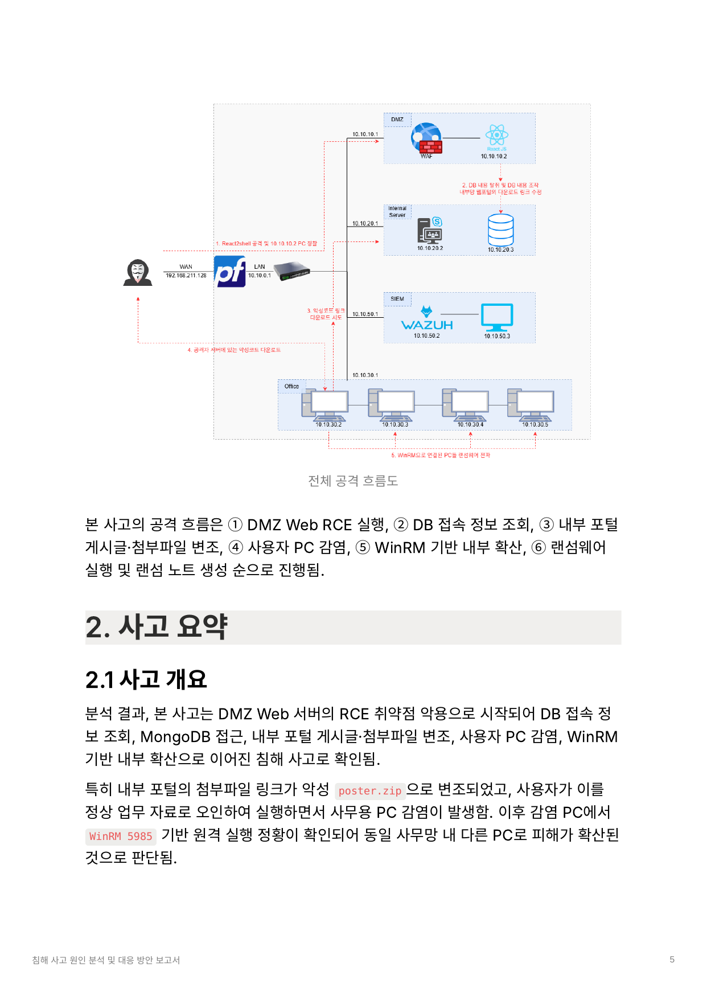

# 보안 사고 원인 분석 및 대응 방안 도출 프로젝트

현대오토에버 모빌리티 SW 스쿨 IT 보안 3기 · 1팀

## 팀원

서윤호 (PM) · 김태훈 · 김민성 · 정유정 · 하준수 · 홍석현

## 프로젝트 개요

DMZ 웹 서버의 실제 취약점(React2Shell, CVE-2025-55182)을 직접 재현해 침투 → 내부 DB 변조 → 사용자 PC 감염 → WinRM 기반 내부 확산 → 랜섬웨어 실행까지 이어지는 침해 시나리오를 구축하고, Wazuh/Sysmon/Coraza WAF 로그를 기반으로 침해사고를 분석·대응한 프로젝트입니다.

이 저장소는 공격 대상이 된 시스템 코드와, 그 코드를 분석·대응한 산출물(인프라 구성, 공격 시나리오, 침해사고 분석 보고서, 대응 방안, 발표자료)을 한 곳에 모은 저장소입니다.

- [apps/external-web](apps/external-web) — DMZ 취약 웹 애플리케이션 (React2Shell 취약점 포함, 원본 `dev` 브랜치 기준)
- [apps/internal-portal](apps/internal-portal) — 내부 직원 게시판

## 구성

| 폴더 | 내용 |
|---|---|
| [apps/external-web](apps/external-web) | DMZ 취약 웹 애플리케이션 코드 |
| [apps/internal-portal](apps/internal-portal) | 내부 포털 코드 |
| [docs/01-infra](docs/01-infra/README.md) | 망 구성도, pfSense/Wazuh 설정 (GUI 기준) |
| [docs/02-attack-scenario](docs/02-attack-scenario/README.md) | 5단계 침해 시나리오, React2Shell 취약점 개요, 랜섬웨어 감염 흐름 |
| [docs/03-incident-report](docs/03-incident-report/README.md) | 침해사고 원인 분석 및 대응 방안 보고서 (원본 PDF 포함) |
| [docs/04-response](docs/04-response/README.md) | 대응 방안 및 반영 전/후 검증 결과 |
| [docs/05-ioc/ioc.md](docs/05-ioc/ioc.md) | 침해 지표(IOC) — IP, 파일 경로, 해시, 탐지 로그 |
| [evidence](evidence/) | Wazuh/Coraza/MongoDB 로그 원본 캡처 |
| [slides](slides/) | 발표 PPT, 시연 영상 |

> `apps/` 안의 코드는 원본 팀 저장소(`dfir-lab-project/external-web`, `dfir-lab-project/internal-portal`)의 스냅샷입니다. 커밋 히스토리는 포함하지 않았고, 최신 코드 상태만 들어있습니다.

## 전체 흐름 한눈에 보기

DMZ Web RCE 실행 → DB 접속 정보 조회 → 내부 포털 게시글·첨부파일 변조 → 사용자 PC 감염 → WinRM 기반 내부 확산 → 랜섬웨어 실행 및 랜섬 노트 생성 순으로 진행됩니다. 자세한 내용은 [02-attack-scenario](docs/02-attack-scenario/README.md)를 참고하세요.

## 결과물

- 침해사고 분석 보고서 (20~30페이지, [docs/03-incident-report](docs/03-incident-report/))
- 발표 PPT ([slides](slides/))
- 시연 영상: _(링크 추가 예정)_

## 자체 평가

**차별성**: 사건 기반 침해 시나리오, 망 분리 구조 반영, 로그·증적 기반 원인 분석, 공격자·방어자 관점 동시 경험

**한계점**: 제한된 서버·사용자 규모, 통제된 계정/환경 기반 시연, EDR·백업·계정 정책 반영 한계, 장기 행위 기반 탐지 부족

**개선 방향**: AD·파일 서버·백업 서버 추가, Wazuh·Suricata 탐지 고도화, 격리·복구·재발 방지 절차 확장, 정상/공격 기준 로그 비교 강화

## 보안 안내

이 저장소는 분석 문서와 탐지 지표(IOC) 중심으로 구성되어 있으며, 실제로 동작하는 공격 스크립트·악성코드 바이너리·전체 익스플로잇 페이로드는 오남용 방지를 위해 올리지 않았습니다. 자세한 내용은 [docs/02-attack-scenario/README.md](docs/02-attack-scenario/README.md)의 안내를 참고하세요.
