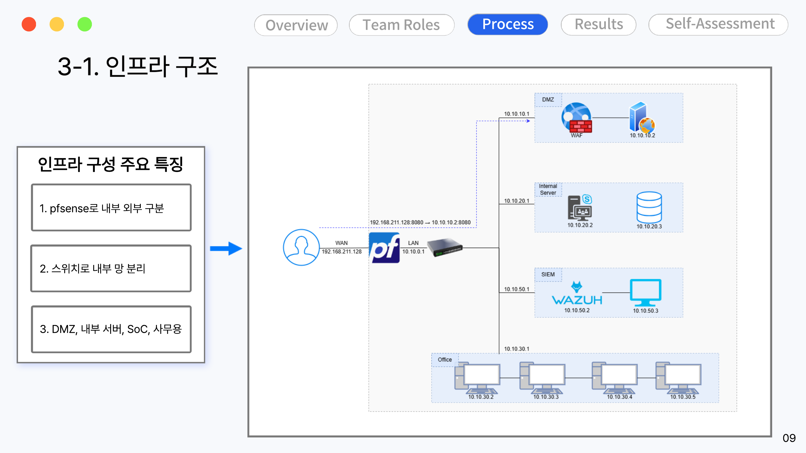
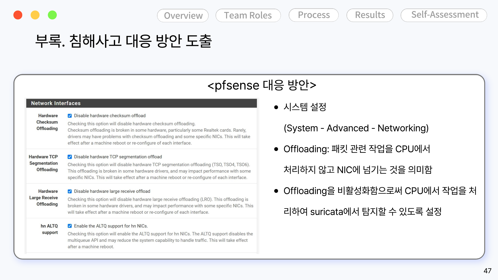
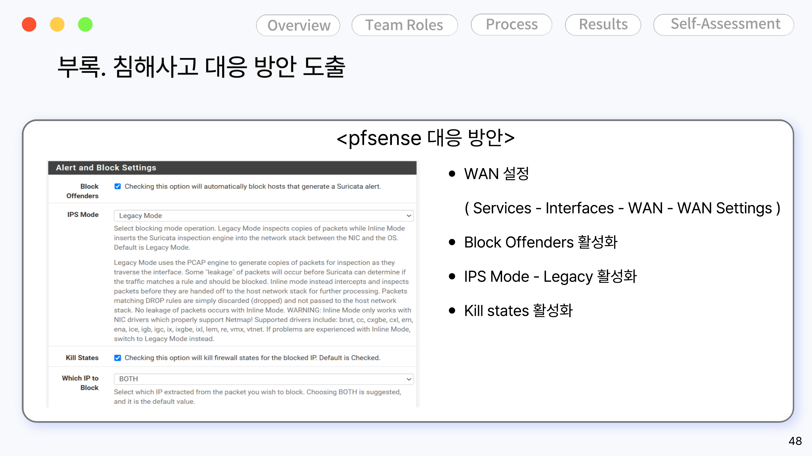
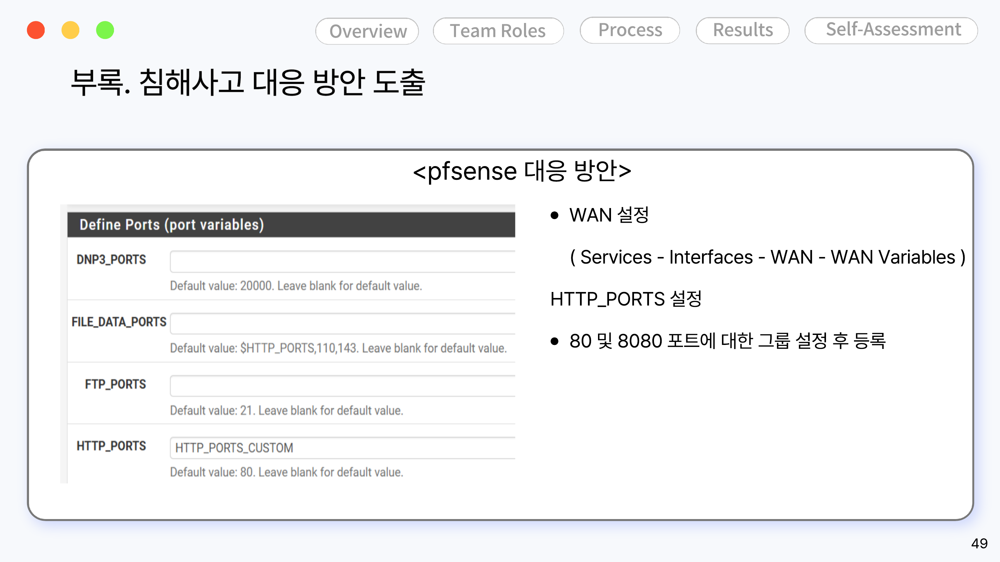

# 01. 인프라 구성

이 프로젝트의 인프라는 IaC(Terraform 등) 코드로 관리하지 않고, **pfSense·Wazuh를 설치한 뒤 관리 화면(GUI)에서 직접 설정을 변경**하는 방식으로 구성했습니다. 그래서 여기서는 "코드"가 아니라 망 구성도와 각 설정 화면 캡처, 그리고 어떤 값을 왜 바꿨는지를 기록해 재현 가능하도록 정리했습니다.

## 망 구성

pfSense를 기준으로 외부(WAN)와 내부(LAN)를 분리하고, 스위치로 내부망을 다시 4개 구역으로 나눴습니다.

| 구분 | 대상 시스템 | IP 대역 | 역할 |
|---|---|---|---|
| DMZ | WEB01 (WAF + WAS) | 10.10.10.0/24 | 외부 노출 웹 서비스 |
| Internal Server | Internal Portal + DB01 | 10.10.20.0/24 | 내부 포털, 게시글/첨부파일 DB |
| SIEM | Wazuh | 10.10.50.0/24 | 보안 이벤트 수집·분석 |
| Office | PC-USER01~04 | 10.10.30.0/24 | 사무용 PC (사용자 단말) |

## pfSense 설정값

기본 설치 이후 실제로 변경한 설정만 정리했습니다. (전체 방안이 반영되는 흐름은 [04-response](../04-response/README.md) 참고)

**Offloading 비활성화** — `System - Advanced - Networking`

패킷 관련 처리를 CPU가 아닌 NIC에서 그대로 처리해버리면 Suricata가 패킷을 검사하지 못하는 문제가 있어, hardware checksum/TCP segmentation/large receive offload를 모두 비활성화했습니다.

**Alert & Block 설정** — `Services - Interfaces - WAN - WAN Settings`

Suricata가 탐지한 공격자 IP를 자동으로 차단하도록 `Block Offenders`를 활성화하고, `IPS Mode`는 Legacy로, `Kill States`도 활성화했습니다.

**포트 변수 설정** — `Services - Interfaces - WAN - WAN Variables`

내부 웹 서비스가 80·8080 포트를 함께 쓰기 때문에 `HTTP_PORTS`에 두 포트를 그룹으로 묶어 등록했습니다.

## 참고

- Wazuh 에이전트를 DMZ Web(10.10.10.2), DB(10.10.20.3), 사무용 PC(10.10.30.2~5)에 설치해 Sysmon·PowerShell·auditd 로그를 중앙 수집했습니다.
- 각 서버별 상세 설치/설정 절차(Wazuh 매니저 설정, Coraza WAF 룰 등)를 스크린샷으로 더 남긴 게 있다면 이 폴더에 `wazuh-setup.md`, `coraza-waf-setting.md` 형태로 추가하는 걸 추천합니다. (해당 캡처는 원본 PDF에 없어서 이번엔 못 채웠습니다 — 필요하면 알려주세요)
