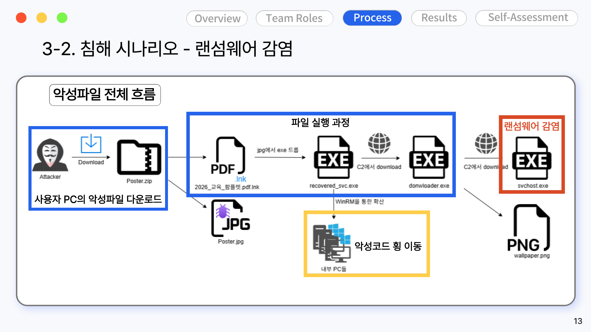
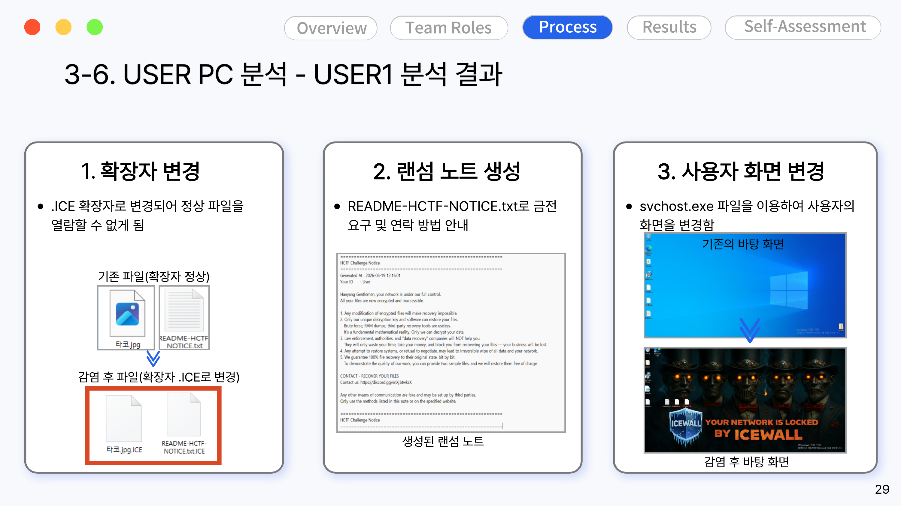

# 02. 공격 시나리오

DMZ 웹 서버의 RCE 취약점을 시작점으로, DB 변조 → 사용자 PC 감염 → 내부 확산 → 랜섬웨어 실행까지 이어지는 5단계 침해 시나리오를 설계하고 직접 재현했습니다.

## 5단계 킬체인

| 단계 | 내용 |
|---|---|
| 1. 최초 침투 | DMZ 웹 서버의 React2Shell(RCE) 취약점 악용, `id`/`.env` 탈취, MongoDB 자산 목록 정찰 |
| 2. 내부 조작 | 탈취한 `DATABASE_URL`로 내부 MongoDB 접속 → 게시글·첨부파일 URL을 악성 `poster.zip` 링크로 변조 |
| 3. 사용자 감염 유도 | 변조된 내부 포털 게시글을 정상 업무 자료로 오인한 사용자가 `poster.zip` 다운로드 및 실행 |
| 4. 내부 확산 | 감염 PC에서 WinRM(5985) 기반 원격 실행으로 동일 사무망 내 다른 PC로 전파 |
| 5. 랜섬웨어 실행 | 각 PC에서 `svchost.exe`로 위장한 랜섬웨어 실행, 파일 암호화 및 랜섬노트 생성 |

## 취약점 개요 — React2Shell (CVE-2025-55182)

Next.js Server Action(`next-action`) 요청을 악용해 `child_process.execSync`로 임의 명령을 실행하고, 결과를 `x-action-redirect` 응답 헤더에 Base64로 담아 반환받는 방식의 RCE입니다. 이 취약점을 이용해 `id`, `.env` 내용, MongoDB 데이터베이스 목록을 순서대로 탈취했습니다.

> 실제로 서버에서 명령을 실행하는 전체 페이로드 원문은 오남용 우려로 이 저장소에는 올리지 않았습니다. 취약점의 동작 원리와 판단 근거(요청/응답 로그)는 [03-incident-report](../03-incident-report/) 원본 보고서 3.1절에 있습니다.

## 랜섬웨어 감염 흐름

정상 문서로 위장한 `.lnk` 바로가기 파일 실행 → 내부에 숨겨둔 `.exe`가 드롭 → 공격자 서버에서 downloader 다운로드 → `svchost.exe`로 위장한 랜섬웨어 본체 실행, 순서로 진행됩니다.

감염 후에는 파일 확장자가 `.ICE`로 변경되고, 랜섬노트(`README-HCTF-NOTICE.txt`)가 생성되며, 바탕화면이 강제로 변경됩니다.

## 공격 재현 스크립트 / 실행 파일에 대해

이 시나리오를 실제로 재현하는 데 쓰인 PowerShell 페이로드, `downloader.exe`, 랜섬웨어 바이너리(`svchost.exe` 위장), `simulate_infection_target.ps1` 등은 **이 공개 저장소에는 포함하지 않았습니다.** 그대로 동작하는 파일이라 외부에 노출되면 악용될 수 있기 때문입니다. 팀 내부 보관용으로만 두거나, 필요하면 비공개 저장소로 따로 분리하는 걸 권합니다. 각 파일의 SHA256 해시값은 탐지에 활용할 수 있도록 [05-ioc/ioc.md](../05-ioc/ioc.md)에 공개해뒀습니다.
