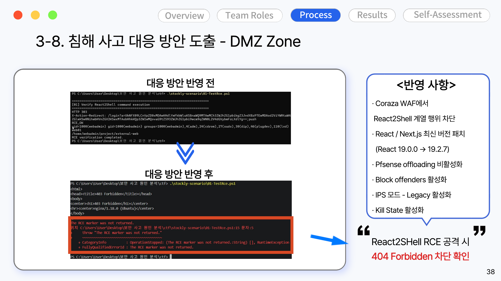
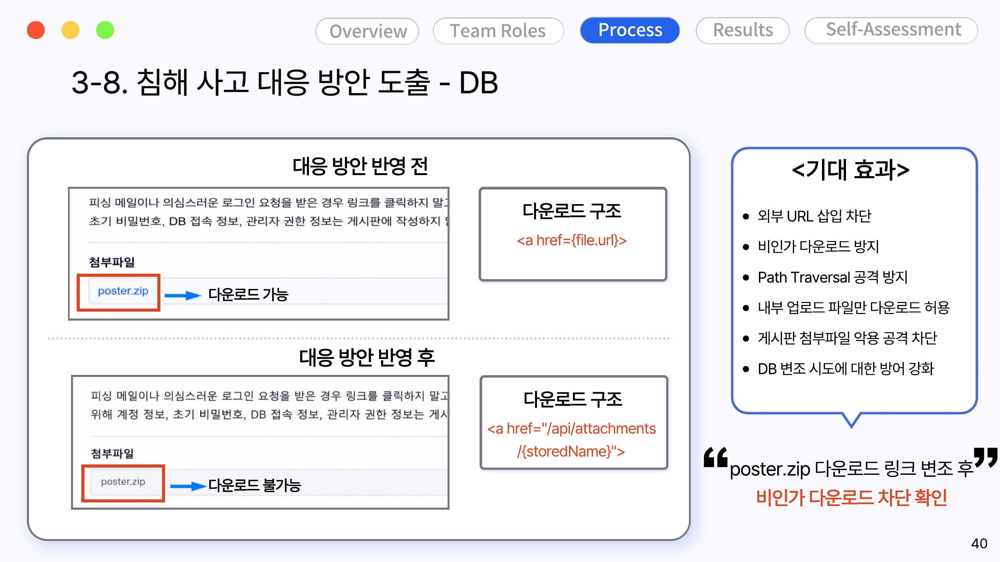
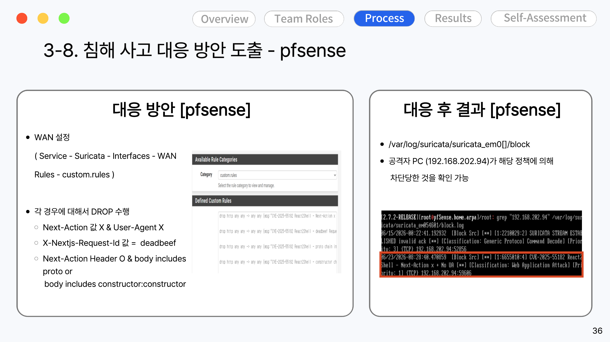

# 04. 대응 방안

침해사고 분석([03-incident-report](../03-incident-report/) 5장 원인 분석)에서 도출한 6가지 원인에 맞춰 DMZ, DB, 방화벽(pfSense/Suricata) 세 영역에 대응 방안을 적용하고, 반영 전/후를 재현 테스트로 검증했습니다.

## DMZ — React2Shell RCE 차단

기존에는 Coraza WAF가 Next.js의 Server Action(`next-action`) 요청 형식을 정상 트래픽으로 오인해 통과시켰습니다. React/Next.js를 취약 버전(19.0.0)에서 패치 버전(19.2.7)으로 올리고, Coraza WAF에 React2Shell 계열 요청(비정상 `Next-Action` 헤더, `constructor.constructor` 패턴 등)을 차단하는 룰을 추가했습니다.

적용 전에는 RCE 페이로드가 정상적으로 실행되어 `RCE_OK`가 반환됐지만, 적용 후에는 `403 Forbidden`으로 차단되는 것을 확인했습니다.

## DB — 첨부파일 다운로드 경로 검증

기존 구조는 DB에 저장된 첨부파일 URL(`attachments.url`)을 그대로 `<a href>`에 사용해서, DB 값이 변조되면 외부 악성 링크(`http://attacker.com/malware.exe`)로 그대로 연결되는 구조였습니다. 다운로드 경로를 `/api/attachments/{storedName}`로 바꿔 로그인 여부, DB 등록 여부, 실제 파일 존재 여부, Path Traversal 여부를 서버에서 검증하도록 수정했습니다.

적용 후에는 DB에 변조된 `poster.zip` 링크가 남아있어도 실제 파일이 없기 때문에 다운로드가 차단됩니다.

## pfSense / Suricata — 공격자 IP 자동 차단

WAN 인터페이스에 React2Shell 요청 패턴(`Next-Action` 값 이상, `X-Nextjs-Request-Id: deadbeef`, `constructor.constructor` 포함 등)을 탐지하는 Suricata 커스텀 룰을 추가하고, 탐지 시 자동으로 DROP 하도록 설정했습니다. (설정 방법은 [01-infra](../01-infra/README.md) 참고)

적용 후 공격자 IP(192.168.202.94)가 정책에 의해 실제로 차단된 것을 로그로 확인했습니다.

## 원인별 대응 요약

| 원인 | 개선 방향 | 우선순위 |
|---|---|---|
| 웹 취약점 관리 미흡 | 취약 버전 점검·패치, WAF 룰 강화, 정기 취약점 진단 | 상 |
| 웹 서버 권한·민감정보 관리 미흡 | 서비스 계정 권한 최소화, 환경변수·설정파일 접근 제한, 비밀정보 저장소 사용 | 상 |
| DB 접근 통제 미흡 | DB 접근 허용 출발지 제한, 계정 권한 최소화, 인증 로그 모니터링 | 상 |
| DB 무결성 검증 부재 | 게시글 변경 이력 관리, 첨부파일 URL 무결성 검증, 외부 URL 등록 제한 | 상 |
| 단말 실행 통제 부족 | PowerShell 로깅 강화, 실행 정책 우회 탐지, AppLocker/WDAC 적용 | 상 |
| WinRM 통제 미흡 | WinRM 기본 비활성화, 허용 대상 IP 제한, 관리망 분리 | 상 |

### 긴급 조치 (사고 직후 우선순위)

1. DMZ Web 서버 취약점 패치 및 RCE 공격 차단 룰 적용
2. `internal_app` 등 DB 관련 계정 비밀번호 변경 및 권한 최소화
3. 내부 포털 게시글·첨부파일 URL 변조 여부 전수 점검
4. 공격자 IP(`192.168.202.94`), `poster.zip`, `downloader.exe`, `hctf_bettleman\svchost.exe` 기준 전사 로그 헌팅
5. 사무용 PC 간 WinRM(5985) 통신 제한 및 원격 관리 대상 분리
